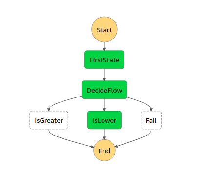

# Welcome
This project was created using Santagostino's starterkit for Step functions.
# Integrations
The idea of the starterkit is to be able to create step functions workflow with Lambda (using pure JS)
# Structure
For this purpose there are 2 main topics to be configured:
- Serverless configuration
- Lambda functions

#### Serverless configuration
In the stepFunctions section of serverless.yaml there is a basic definition of a state machine. This basic configuration 
has the execution of a lambda that calculates a random number and then using that value it makes a decision to execute one 
lambda or another. 

#### Lambda function
The `handler.js` located in the `/src` folder is by default the lambda function of this starterkit and gets automatically deployed.
There are 3 functions inside this handler to achieve the basic logic of the state machine

# Integration
By default, a REST Api will be deployed in order to invoke the step function workflow but this can be modified to be triggered by other services. 
For more information see the [Serverless Step Functions](https://www.serverless.com/plugins/serverless-step-functions) documentation

# Deployment - CI/CD
This starterkit comes with an already configure pipeline to run on Github Actions.
The pipeline involves 3 workflows: `QA`, `stage` and `prod`.
- `QA`: It's a workflow only to run Quality Assurance (tests and linting) on developing branches.
- `Stage`: This workflow has also a QA job (workflows cannot be dependent on each other) and a deployment with serverless for stage environment. The script requires two secrets on the github repository (or organization): `AWS_ACCESS_KEY_ID` and `AWS_SECRET_ACCESS_KEY` 
- `Prod`: This workflow has also a QA job (workflows cannot be dependent on each other) and a deployment with serverless for production environment. This workflow is only manually executable on Github Actions. The script requires two secrets on the github repository (or organization): `AWS_ACCESS_KEY_ID` and `AWS_SECRET_ACCESS_KEY`
